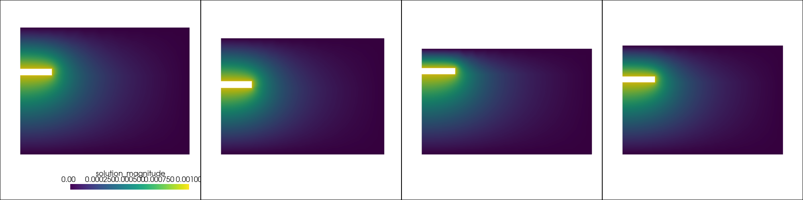

# GetDP experiments

Scripts of generating and running GetDP experiment distributions.

Simple working example in `vis.ipynb`. The example is a distribution over different input geometries and initial conditions, five samples for a simple electrosstatics problem are shown below:

